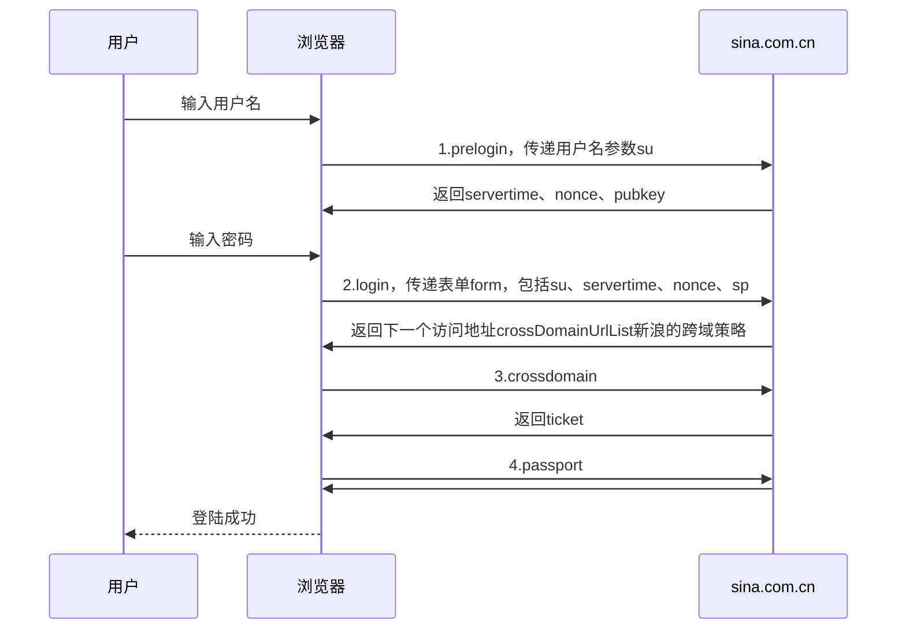

# 如何实现微博登录，在loginWeiobo文件夹中
参考教程：[【自己动手写Python微博库】1.微博登录分析](https://zhuanlan.zhihu.com/p/142413583) 系列文章

爬取微博的一些数据，如果先登录微博会有很多的限制，比如看不到用户详情信息、以及用户关注列表和粉丝列表。因此，当你要抓取用户信息时必须先登录微博。

微博登录的难点在于：

* 给每个账户都默认开了登陆保护，即输入用户名和密码之后（有时候还会有验证码），还需要进行短信验证或私信验证，就博主目前的爬虫技术来说还无法解决这样的反爬虫。因此找了一条路绕过登陆保护，也就是，**通过登录新浪邮箱，再从新浪邮箱跳转到微博，这样可以直接登录。***我用来做爬虫的微博账号都是通过新浪邮箱注册的，所以这种方法仅针对通过新浪邮箱的账号和密码来登录微博的情况。*
* 一般的登录过程是通过post方法用表单的方式，把用户名和密码的信息传递给服务器。但微博登录有对用户名和密码进行加密，所以在form表单中无法直接看到用户名和密码。所以要搞清楚加密方式，模拟登陆时需要传递加密后的用户名和密码。

本文用Python登录微博，使用到Request库

# 一、新浪邮箱登录过程

微博的登录过程应该是与之类似的，不过在第四步时不会直接跳转到用户主页，而是跳转到验证登录页面，要求用户进行短信验证或私信验证。

# 二、代码实现过程
## 1.结构框架
weibo.py 微博主类
```
class WeiboLogin(object):
    def __init__(self, account, password):pass
    def login(self):pass
    def getcookies():pass
```
utils.py 工具类
```
class WbUtils(object):
    # RSA加密
    @staticmethod
    def encrypt_passwd(passwd, pubkey, servertime, nonce):pass
    # 登录请求的参数
    @staticmethod
    def getLoginStructure(account, password, pre_login):pass
```
test.py 测试类
```
from weibo import WeiboLogin

if __name__ == '__main__':
    we = WeiboLogin('account', ''password')
    we.login()
```
博主新浪邮箱登陆的代码是参考 网上关于微博登录的，因此要想**把微博登录转为新浪邮箱登陆**，需要改的地方有：1.headers的`'Referer'`；2.WbUtils类中的`'entry'`从`'weibo'`改为`'freemail'`；3.prelogin中params的`"entry"`改为`"cnmail"`
## 2.登录过程
### 2.1登录邮箱
```
class Login_mail(object):
    # 用户ID
    uid = ''

    def __init__(self, account, password):
        self.account = account
        self.password = password
        # 建立新的会话
        self.session = requests.session()
        # 设置请求头
        self.session.headers = {
            'Referer':'https://mail.sina.com.cn/?from=mail',
            'User-Agent':'Mozilla/5.0 (Windows NT 10.0; Win64; x64) AppleWebKit/537.36 (KHTML, like Gecko) Chrome/70.0.3538.102 Safari/537.36 Edge/18.18362',
        }
        
        self.prelogin_url='https://login.sina.com.cn/sso/prelogin.php'
        self.login_url='https://login.sina.com.cn/sso/login.php?client=%s'

    def login(self):
        # 1.PreLogin
        
        su = base64.b64encode(urllib.parse.quote(self.account).encode('utf-8')).decode('utf-8')
        params={
            "entry":"cnmail",
            "callback":"sinaSSOController.preloginCallBack",
            "su":su,#base64编码之后的用户账号
            "rsakt":"mod",
            "client":"ssologin.js(v1.4.19)",
            "_":int(time.time()*1000)#时间戳
            }
        resp = self.session.get(self.prelogin_url,params=params,verify = False)
        pre_login = json.loads(re.match(r'[^{]+({.+?})', resp.text).group(1))

        # 2.Login
        resp = self.session.post(self.login_url  % sso_login, 
                                 data=WbUtils.getLoginStructure(self.account, self.password, pre_login),
                                 verify = False)
        resp.encoding='gbk'
        
        # 3.CrossDomain
        crossdomain2 = re.search(r'(https://[^;]*)', resp.text).group(1)
        print('crossdomain2',crossdomain2)
        resp = self.session.get(crossdomain2,verify = False)
       
        # 4.Passport
        passporturl = re.search('(https://passport[^\"]*)', resp.text.replace('\/', '/')).group(0)
        print('passporturl ',passporturl)
        resp = self.session.get(passporturl,verify = False)
        resp.encoding='gbk'
        
        # 获取登录信息
        login_info = json.loads(re.search('\((\{.*\})\)', resp.text).group(1))
        self.uid = login_info["userinfo"]["uniqueid"]
        print(self.uid)
    
    def login_weibo(self):
        self.session.headers={
            'User-Agent':"Mozilla/5.0 (Windows NT 10.0; Win64; x64) AppleWebKit/537.36 (KHTML, like Gecko) Chrome/70.0.3538.102 Safari/537.36 Edge/18.18362"
            }
        uid = self.login_mail()
        resp = self.session.get('https://weibo.com/u/%s/home?wvr=5' % uid)
```
### 2.2关于加密
#### 2.2.1prelogin中对用户名的加密
#request.su=sinaSS0Encode.base64.encode(urlencode(username)) 对用户名进行加密

#### 2.2.2login中对密码进行加密


### 2.3测试
引入以上写的类，实例化，将用户名和密码作为参数传入
